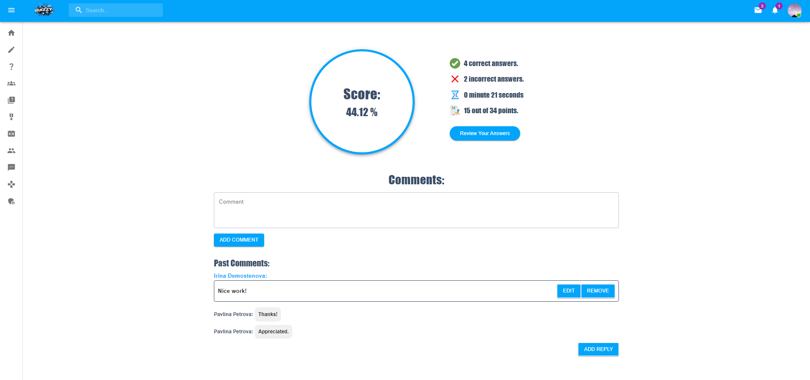

# Quizzy-App
 
Example Educator Credentials:
email: educator@gmail.com
password: Educator123
 
Example Student Credentials:
email: student@gmail.com
password: Student123
 
Example Admin + Educator Credentials:
email: admin@gmail.com
password: Admin123
 
# Project Description
 
## Title: Quizzy Application
 
### Experience the Magic of Our Application
Immerse yourself in the interactive and engaging experience we've crafted just for you. Click [here](https://quizzy-application-f0713.web.app/) and let the journey begin!

### Overview
 
Are you passionate about quizzes? Do you thrive on knowledge, friendly competition, and connecting with like-minded individuals? Look no further! Quizzy is here to elevate your quiz-taking experience. 🌟

 
## Key Features
 
### Educators’ Hub: Empowering Educators
 
Our dedicated educators play a pivotal role. They create, curate, and manage quizzes across various subjects. Whether it’s history, science, or pop culture, they’ve got it covered!

 
### Student Monitoring
 
Educators can track student progress and provide feedback. It’s all about fostering growth and learning.

 
### Friendship Network
 
Connect with fellow quiz enthusiasts. Add them to your friend list and stay in the loop.

 
### Live Battle Mode: The Ultimate Showdown
 
Feeling competitive? Engage in live battles! Choose a category you’re confident in, and Quizzy will generate two random questions. It’s a rapid-fire challenge where knowledge meets adrenaline.

 
### Challenge Accepted
 
Dare a friend, an educator, or anyone in your network. The stakes are high, the clock is ticking, and victory awaits!

 
### Sleek Interface: User-Friendly Design
 
Our intuitive interface ensures smooth navigation. Whether you’re a tech-savvy student or a seasoned educator, Quizzy welcomes you.

 
### Responsive Chat
 
Message friends, discuss quiz strategies, or share fun facts. Communication is key, and we’ve got you covered.

 
## Why Choose Quizzy?
 
- Knowledge Boost: Learn, explore, and expand your horizons.
- Socialize: Forge connections with fellow learners and educators.
- Adrenaline Rush: Live battles keep you on your toes.
- Fun and Educational: Because quizzes don’t have to be boring!
 
So, whether you’re a seasoned quizmaster or a curious learner, join the Quizzy community today. 🎯📚🔥

## Project Structure
You will find the following folders and files:

1. src/AppContext - the main context provider where all the global state of the application is being held.
2. src/components - contains all the smaller components used to build the application.
3. src/views - contains all the routed components - About us, Admin Educators,AdminHome,AdminPanel,AdminQuizzes,AdminStudents,AdminUsers,BlockedUsers,CreateGroup,CreateQuiz,CreateSuccessView,EditQuiz,EducatorGroups,Friends,GroupDetails,Home,HomeWhenLoggedIn,LiveBattle,LiveBattleFinalView,LiveBattleMain,Messenger,MyQuizzes,NotFound,PublicQuizView,PublicQuizzes,QuizzesView,ResultDetails,Scoreboard,SignIn,SignUp,SingleStatisticsView,TakenQuizViewDetails,TakenQuizzes,UserProfile,ViewDetailsSingleQuizStatistics
4. src/config - the firebase configuration file.
5. src/Images - all the images that are used in the application.
6. src/services - services functions for users, posts, and authentication used to manipulate firebase data.
7. App.jsx - the composition root of the application.